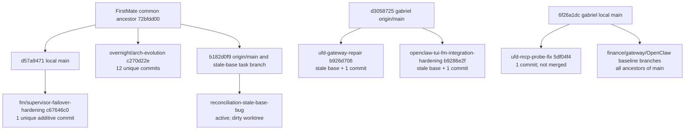

# Source-control reality

Snapshot captured 2026-09-13 at 12:58 BRT. This is a read-only inventory; no
fetch, checkout, reset, clean, rebase, merge, deletion, or push was performed.
The machine-readable companion is `data/reconciliation/source-control-inventory.json`.

## Executive result

The two required repositories have different kinds of drift:

| Repository | Real local main | Recorded origin/main | Relationship | Immediate risk |
|---|---|---|---|---|
| captain-workspace | `d57a9471705718a4205e84284441aa722e79a2f7` | `b182d0f908b78d08c7ccb8dce3775bdca8c5d657` | local ahead 2, behind 48 | multiple valuable local/remote lines; overnight is 12 commits and must not be merged wholesale |
| gabriel-os | `6f26a1dcb9fa8b45a1e3dccc518ab0c752b1272e` | `d30587253e0ef39efa278c3629ecfd88cecb3060` | local ahead 38 | local main is dirty; two worker branches were based on stale `d305872` |

The valuable unlanded work is explicit: `fm/supervisor-failover-hardening`
(one additive commit), `fm/ufd-mcp-probe-fix` (one healthy commit), and the
two stale-base branches `fm/ufd-gateway-repair` and
`fm/openclaw-tui-fm-integration-hardening`. The latter two must be reconciled
against current `gabriel-os` main before any landing decision.

## Repository inventories

### captain-workspace

Remotes are `origin=https://github.com/kunchenguid/firstmate`,
`fork=git@github.com:GabrielSgrancio/firstmate.git`, and the local
`no-mistakes` evidence remote. Local `main` is clean and tracks `origin/main`
at ahead 2 / behind 48.

| Branch | HEAD | merge-base with local main | local-main ahead / branch ahead | landing observation |
|---|---|---|---:|---|
| `main` | `d57a9471` | `d57a9471` | 0 / 0 | clean local default |
| `overnight/arch-evolution` | `c270d22e` | `d57a9471` | 0 / 12 | 106 files, 11,790 additions, 24 deletions; historical mixed work |
| `fm/supervisor-failover-hardening` | `c67646c0` | `d57a9471` | 0 / 1 | valuable, committed, not landed |
| `fm/firstmate-acp-transport-opt-in` | `a9632a7d` | `72bfdd00` | 2 / 1 | committed feature line, not on current main |
| `backup/pre-update-2026-09-08` | `e4c76840` | `733a5047` | 261 / 2 | same commit as local antigravity backup |
| `local/antigravity-harness` | `e4c76840` | `733a5047` | 261 / 2 | same commit as backup; duplicate checkout also exists |
| `agy-orchestrator` | `24c6aded` | `f66be0f8` | 99 / 7 | identical to `fork/agy-orchestrator`; seven unique commits |
| `fm/reconciliation-stale-base-bug` | `b182d0f9` | `72bfdd00` | 2 / 48 | current origin/main tip, active task branch |

`git cherry main overnight/arch-evolution` reports 12 `+` commits and no `-`
rows. The same check against the relevant feature branches produced no
patch-equivalent `-` rows. Exact duplicate ref pointers are called out above
because identical pointers are duplication, not unmerged work.

The focused reflog shows an overnight checkout back to `main`, a rebase of
the antigravity changes onto `origin/main`, and a reset to `HEAD`; there is no
evidence in the focused recent window of a destructive reset of the valuable
branches.

### gabriel-os

The only configured remote is `origin=git@github.com:GabrielSgrancio/gabriel-os.git`.
Local `main` is dirty with seven modified tracked files and seven untracked
files (listed in the JSON inventory). It tracks the stale recorded
`origin/main` at ahead 38 / behind 0.

| Branch | HEAD | merge-base with local main | local-main ahead / branch ahead | result |
|---|---|---|---:|---|
| `main` | `6f26a1dc` | `6f26a1dc` | 0 / 0 | dirty current default |
| `fm/ufd-mcp-probe-fix` | `5df04f4f` | `6f26a1dc` | 0 / 1 | healthy committed, not merged |
| `fm/ufd-gateway-repair` | `b926d706` | `d3058725` | 38 / 1 | stale-base committed work, not merged |
| `fm/openclaw-tui-fm-integration-hardening` | `b9286e2f` | `d3058725` | 38 / 1 | stale-base committed work, not merged |
| `fm/openclaw-terminal-home-baseline` | `ca31f3fb` | itself | 1 / 0 | ancestor of main; reproducible |
| `fm/gos-finance-*` | `fe29dd0b`, `2a49f5eb`, `06d479bb` | each itself | 7/0, 8/0, 6/0 | all ancestors of main |
| `fm/gos-gateway-*` | `fc43bdc`, `6b3170d8`, `79b0fdfc` | each itself | 3/0, 5/0, 4/0 | all ancestors of main |
| `main-ref` | `aab6c4e1` | itself | 84 / 0 | ancestor line |

The branch reflogs prove the distinction between the three UFD workers:
gateway and OpenClaw were created from `d305872` on 2026-09-12/13; MCP was
created from `d305872` but explicitly rebased onto current local `main` at
2026-09-12 22:10:58 before its commit. `git cherry main <branch>` returns
only the worker commit for each UFD branch; no patch-equivalent `-` row was
found.

## Worktree-to-work mapping

All Treehouse worktrees in the two requested pools are recorded in the JSON
file. The important subset is summarized here.

| Worktree | Task / branch | HEAD and base | state / result | classification |
|---|---|---|---|---|
| captain `.../3` | supervisor-failover-hardening | `c67646c0` / `d57a9471` | Herdr done; status has `done:`; not reachable from main | `VALUABLE_COMMITTED_NOT_LANDED` |
| captain `.../7` | current inventory scout; detached | `b182d0f9` / `72bfdd00` | Herdr working; no result yet | `LIVE_ACTIVE` |
| captain `.../8` | overnight decomposition scout; detached | `b182d0f9` / `72bfdd00` | Herdr working; no result yet | `LIVE_ACTIVE` |
| captain `.../9` | stale-base task branch | `b182d0f9` / `72bfdd00` | Herdr working; dirty `docs/documentation-audiences.json` | `LIVE_ACTIVE` |
| captain `.../10` | operational-state scout; detached | `b182d0f9` / `72bfdd00` | Herdr working; no result yet | `LIVE_ACTIVE` |
| gabriel `.../2` | `fm/ufd-gateway-repair` | `b926d706` / `d3058725` | Herdr done; `done:` status; not landed | `VALUABLE_COMMITTED_NOT_LANDED` |
| gabriel `.../3` | `fm/ufd-mcp-probe-fix` | `5df04f4f` / `6f26a1dc` | Herdr done; archived `done`; not landed | `VALUABLE_COMMITTED_NOT_LANDED` |
| gabriel `.../4` | `fm/openclaw-tui-fm-integration-hardening` | `b9286e2f` / `d3058725` | Herdr done; `done:` status; not landed | `VALUABLE_COMMITTED_NOT_LANDED` |
| gabriel `.../5` | detached copy of main | `6f26a1dc` / itself | clean, no task record | `SAFE_GC_CANDIDATE` |

Herdr snapshot identifiers were captured for every live or recently active
task. The four active reconciliation panes are `w2G:p2`, `w2H:p2`, `w2J:p2`,
and `w2K:p2`; the completed worker panes are `w2C:p2`, `w1P:p2`, `w1Q:p2`,
and `w2D:p2`. No `.lease-*` records were visible, so lease state is recorded
as not observable rather than inferred.

`tasks-axi show` against the authoritative backlog reports current
reconciliation tasks as `in_flight`, `supervisor-failover-hardening` and
OpenClaw integration as `done`, and the two UFD tasks as `NOT_FOUND` because
they are archived in `done-archive.md`. The `done:` status line is therefore
execution/report evidence only; reachability from the repository's actual
local main remains false for all three unmerged Gabriel worker branches.

## Treehouse pool residue

The captain-workspace pool has 16 slots and the gabriel-os pool has five.
Besides active meta records, the pools contain populated slots with no
`state/<id>.meta`: captain slots 1, 2, 4, 5, 6, 11–16 and Gabriel slots 1
and 5. Slots with untracked material are `UNKNOWN_DO_NOT_TOUCH`; clean detached
slots whose HEAD is reachable from a known main/remote are only
`SAFE_GC_CANDIDATE`, never an instruction to delete. Other populated pools
(`dotfiles`, `quota-axi`, `smoke-test-fm`, and historical scratch/AGY pools)
are listed in the JSON inventory and were not touched.

## Root cause of stale-base incident

The current FirstMate spawn implementation does perform a freshness action,
but its target is specifically the fetched `origin/<default>`:

* `bin/fm-spawn.sh:2589-2605` checks cleanliness and skips only originless
  worktrees.
* `bin/fm-spawn.sh:2606-2627` fetches `origin`, resolves its default, and
  hard-resets the pooled worktree to `origin/<default>`.
* `bin/fm-spawn.sh:3345-3366` allocates/claims the Treehouse slot and invokes
  that refresh before launch.
* `bin/fm-spawn.sh:3889-3902` writes task metadata, but there is no
  `base_sha` or `target_branch` field.

For local-only `gabriel-os`, `origin/main` was `d305872` while the real local
main was `6f26a1d`. Thus a clean pooled slot could be refreshed successfully
and still be stale relative to the intended local delivery target. The
gateway and OpenClaw worker reflogs show exactly this sequence: reset to
`origin/main` (`d305872`), branch creation from `d305872`, then one worker
commit. MCP avoided the final problem only because it was manually rebased to
`6f26a1d` before committing.

`bin/fm-merge-local.sh:107-111` does refuse a branch that is not a
fast-forward of local default, so these two branches are not silently
fast-forwardable. However, that is a late ancestry gate, not a recorded
base/drift check: it does not tell the worker that its `READY` result is
unsafe, does not compare recorded base to current target, and does not detect
the disproportionate deletion anomaly before delivery is attempted.

## Lineage graph

## Recommended landing order

1. Preserve the dirty `gabriel-os` main and all untracked work until it is
   separately inventoried.
2. Treat gateway and OpenClaw branches as salvageable content, not mergeable
   branches. Reconcile each onto `6f26a1d` in a separately authorized,
   reviewable operation.
3. Land or otherwise explicitly handle `fm/ufd-mcp-probe-fix`; it is not
   stale-base contaminated, but it is still not reachable from main.
4. Rebase/review `fm/supervisor-failover-hardening` against the current
   firstmate main before any landing decision.
5. Decompose `overnight/arch-evolution` commit by commit. Do not merge the
   branch as a unit.
6. Add durable spawn metadata (`base_sha`, target branch, and drift/anomaly
   state) and make delivery readiness fail closed when those values do not
   reconcile.
